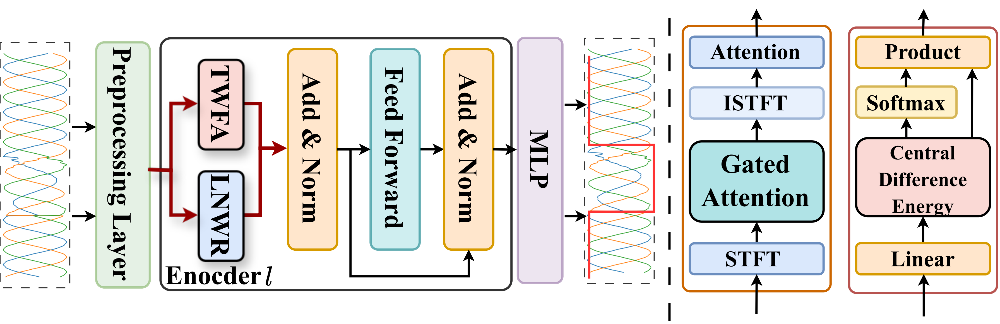
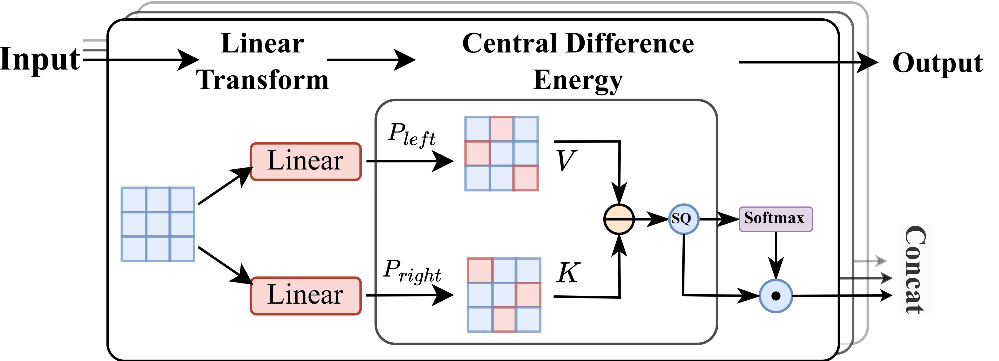
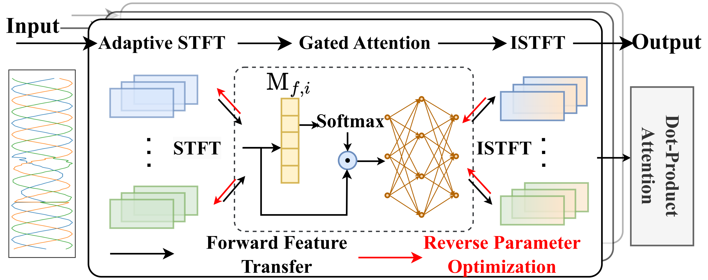

# 2TDformer: DSP-Enhanced Transformer for Weak Single Phase-to-Ground Fault Dual-Time Detection

Official implementation of the paper:

**Weak Single Phase-to-Ground Fault Time Detection with Learnable-Parameter-Driven DSP-Enhanced Transformer**  
*IEEE Transactions on Smart Grid*, 2025.

---

## ⭐ Overview

2TDformer is a DSP-enhanced Transformer designed for dual-time detection (fault initiation and duration) of weak and nonlinear Single Phase-to-Ground Faults (SPGFs) in Resonantly Grounded Distribution Networks (RGDNs).

It integrates two learnable DSP modules:

- **TWFA** — Transient Weak Feature-Enhancement Attention  
- **LNWR** — Learnable Nonlinear Waveform Reconstruction  

These modules amplify weak transients and capture nonlinear multi-scale spectral characteristics.  
2TDformer jointly optimizes all DSP parameters via backpropagation, significantly improving detection accuracy.

The model achieves:

- **97.10% detection accuracy**
- **≤ 1.4 ms initiation error**
- **≤ 2.8 ms duration error**
- **35–58% improvement** over 11 baseline models


## 📐 Model Architecture

The overall architecture of 2TDformer is illustrated in the figure below:

<p align="center">
  
</p>

The structures of TWFA and LNWR are shown side-by-side below:

<p align="center">
  
  
</p>


## 🔧 Installation

Clone the repository:

```bash
git clone https://github.com/smartlab-hfut/2TDformer-for-Weak-Fault-Time-Detection.git
cd 2TDformer-for-Weak-Fault-Time-Detection
bash```


Install dependencies:
pip install -r requirements.txt

🚀 Usage
python main.py \
    --data_path ./data \
    --batch_size 16 \
    --epochs 50 \
    --lr 0.001 \
    --num_heads 6 \
    --d_hid 400 \
    --d_inner 400 \
    --n_layers 1 \
    --dropout 0.0 \
    --mul_dim 3 \
    --step_size 50


