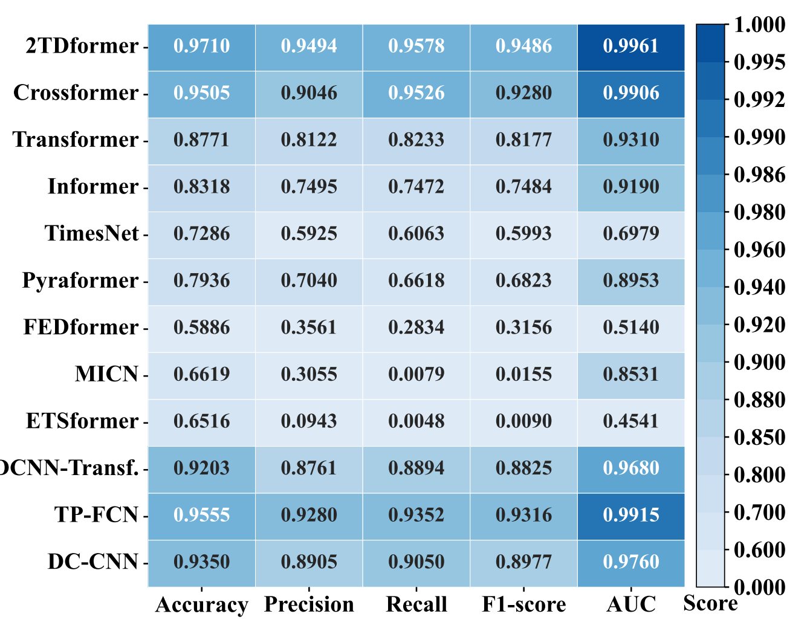
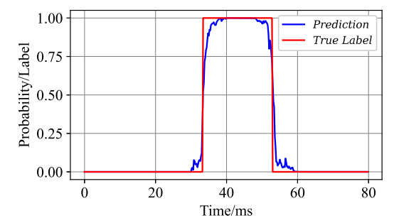
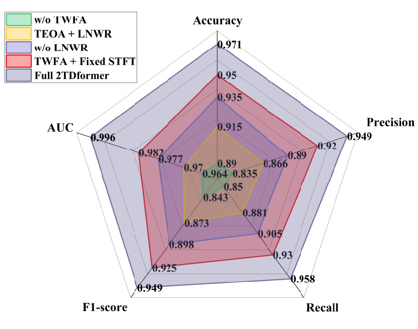

<h1 align="center">⚡ Weak Single Phase-to-Ground Fault Time Detection with Learnable-Parameter-Driven DSP-Enhanced Transformer</h1>

<p align="center">
  <i>Official implementation of the IEEE Transactions on Smart Grid (TSG) 2025 paper</i>
</p>

<p align="center">
  
  
  
  
</p>

---

## ⭐ Overview

2TDformer is a **DSP-enhanced Transformer** designed for high-precision **dual-time detection** (fault initiation & duration) of weak and nonlinear SPGFs in Resonantly Grounded Distribution Networks (RGDNs).

It integrates two novel learnable DSP modules:

- 🔵 **TWFA** — Transient Weak Feature-Enhancement Attention  
- 🟠 **LNWR** — Learnable Nonlinear Waveform Reconstruction  

These modules amplify faint transients, reconstruct nonlinear spectrum evolution, and significantly boost time-wise detection accuracy.

</div>

### 🔥 Key Advantages
- 🚀 **97.10% accuracy**, outperforming 11 SOTA baselines  
- ⏱ **1.4 ms** initiation error  
- 📏 **2.8 ms** duration error  
- 🎯 Robust against nonlinear restriking and high-impedance faults  

---

## 📐 Model Architecture

### 🔹 Full 2TDformer Architecture  
<p align="center">
  
</p>

### 🔹 DSP Modules  
<p align="center">
  
  
</p>

---

## 🔧 Installation

```bash
git clone https://github.com/smartlab-hfut/2TDformer-for-Weak-Fault-Time-Detection.git
cd 2TDformer-for-Weak-Fault-Time-Detection
pip install -r requirements.txt
````

---

## 🚀 Usage

```bash
python main.py --data_path ./data --batch_size 16 --epochs 50 \
    --lr 0.001 --num_heads 6 --d_hid 400 --d_inner 400 \
    --n_layers 1 --dropout 0.0 --mul_dim 3 --step_size 50
```

---

## 📡 Dataset

```
data/
├── train_data2.csv
├── train_label2.csv
├── test_data2.csv
└── test_label2.csv
```

Each sample: **[400 time-steps × 6 channels]**
Labels: **[400]** time-wise binary mask

Signals include: Ua, Ub, Uc, Ia, Ib, Ic
Normalization is performed automatically during preprocessing.

---

## 📊 Experimental Results

### 🔹 Baseline Comparison

<p align="center">
  
  
</p>

2TDformer achieves the top performance in all major metrics.

---

### 🔹 Ablation Study

<p align="center">
  
</p>

TWFA + LNWR = maximum synergy and best performance.

---

## 📚 Citation

```bibtex
@article{2tdformer2025,
  title={Weak Single Phase-to-Ground Fault Time Detection with Learnable-Parameter-Driven DSP-Enhanced Transformer},
  author={Luo, Huan and Li, Qiyue and Zhou, Hao and Sun, Wei and Li, Weitao and Liu, Zhi and Ji, Yusheng and Ding, Lijian},
  journal={IEEE Transactions on Smart Grid},
  year={2025}
}

@article{Li_2023_Incipient,
  title={Incipient Fault Detection in Power Distribution System: A Time–Frequency Embedded Deep-Learning-Based Approach},
  author={Li, Qiyue and Luo, Huan and Cheng, Hong and Deng, Yuxing and Sun, Wei and Li, Weitao and Liu, Zhi},
  journal={IEEE Trans. Instrum. Meas.},
  year={2023},
  volume={72},
  pages={1--14}
}
```

---

## 📬 Contact

📧 **Huan Luo** — [luohuan@mail.hfut.edu.cn](mailto:luohuan@mail.hfut.edu.cn)
